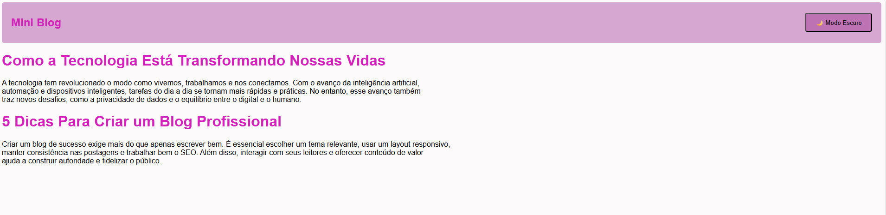

## 🌗 O que eu aprendi com o Dark Mode

  
  

Neste projeto, aprendi a criar um botão que ativa o **modo escuro (dark mode)** em um site, utilizando **HTML**, **CSS** e **JavaScript**. Com isso, aprendi a:

- Usar `classList.toggle()` para alternar classes no HTML.
- Alterar dinamicamente o texto do botão com `textContent`.
- Estilizar o modo escuro usando uma classe `.dark` no CSS.
- Aplicar transições suaves com `transition` para melhorar a experiência do usuário.
- Escrever um código mais limpo, organizado e profissional.

Esse exercício me ajudou a entender melhor como aplicar interatividade e temas dinâmicos em páginas web.
